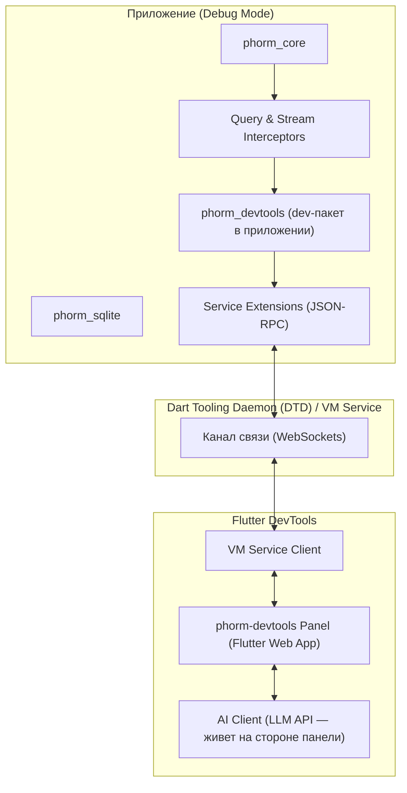

# Техническое задание: Phorm Studio / phorm-devtools (Flutter DevTools Extension)

Данный документ представляет собой подробное техническое задание (ТЗ) на разработку расширения отладки для ORM-системы **PHORM** в экосистеме Flutter.

**Брендинг:** публичное имя продукта в UI, на сайте и в маркетинге — **Phorm Studio**. Технические имена пакетов остаются `phorm_devtools` (мост в приложении) и `phorm_devtools_extension` (панель DevTools).

> **Продуктовая цель:** `phorm-devtools` — коммерческий продукт (подписочная модель). Это значит, что планка качества выше, чем у типичного OSS-инструмента: расширение должно закрывать **все** повседневные задачи работы с БД (инспекция, редактирование, профайлинг, миграции, реактивность), быть быстрым, стабильным и приятным в использовании — настолько, чтобы у пользователя возникало желание заплатить.

---

## 1. Общие сведения и цели проекта

**Название проекта:** `phorm-devtools`
**Тип проекта:** Flutter DevTools Extension
**Модель распространения:** Freemium / подписка (см. раздел 6)
**Целевая аудитория:** Dart & Flutter разработчики, использующие PHORM для управления локальными и серверными базами данных.

### Основные цели:
1. **Прозрачность данных (Data Visibility):** Предоставить удобный графический интерфейс для инспектирования локальных баз данных (SQLite/WASM и др.) без необходимости экспортировать файлы БД.
2. **Профайлинг производительности (Performance Profiling):** Дать разработчикам возможность анализировать сгенерированные SQL-запросы, время их выполнения, план выполнения (`EXPLAIN QUERY PLAN`) и оценивать эффективность JSON Aggregation.
3. **Интерактивное тестирование реактивности (Reactivity Debugging):** Упростить отладку реактивных стримов (`watchOne`, `watchAll`), отслеживая их зависимости и жизненный цикл.
4. **Управление схемой БД (Schema DX):** Сделать процесс отладки миграций и сидирования данных быстрым и интерактивным.
5. **Коммерческое качество (Paid-grade DX):** Полировка UX (горячие клавиши, экспорт, сохранённые запросы, мультибазовость) до уровня, за который платят.

---

## 2. Архитектура интеграции

Расширение разрабатывается по стандарту **Flutter DevTools Extensions** (начиная с Flutter 3.16+). Оно состоит из двух ключевых частей:



### 2.1. Разделение на пакеты и безопасность сборок

Отладочный код **не живёт в ядре**, а выносится в отдельный пакет **`phorm_devtools`**:

* `phorm_core` предоставляет только нейтральные хуки (`onQueryExecuted`, `onStreamCreated`, `onStreamDestroyed`) — пустые no-op колбэки с нулевой стоимостью, когда никто не подписан.
* `phorm_devtools` подключается приложением в `dev_dependencies`? — нет: DevTools-мост должен быть доступен в debug-рантайме, поэтому пакет подключается в обычные `dependencies`, но весь его код обёрнут так, чтобы **гарантированно tree-shake-иться из release**:

```dart
/// Вызывается пользователем один раз при старте приложения.
void enablePhormDevtools(DB db) {
  // assert-тело исполняется только в debug и полностью
  // вырезается компилятором из release/profile сборок.
  assert(() {
    PhormDevtoolsBridge.attach(db);
    return true;
  }());
}
```

**Требования безопасности:**
* В release- и profile-сборках ни один RPC-метод не регистрируется, интерцепторы не подключаются (проверяется тестом на размер/содержимое AOT-снапшота).
* `ext.phorm.rawSql` (выполнение произвольного SQL из панели) доступен только в debug и требует явного подтверждения в UI при мутирующих запросах (`UPDATE`/`DELETE`/`DROP` без `WHERE` — красное предупреждение).
* Все destructive-операции (`resetDb`, hard delete) в панели защищены confirm-диалогом.

### 2.2. Мультибазовость (Multi-DB)

Приложение может открывать несколько баз (или одну на изолят). Поэтому:

* Каждый RPC-метод принимает обязательный параметр **`dbId`**.
* Метод `ext.phorm.listDatabases` возвращает список подключённых баз (id, label, backend: sqlite/wasm/..., путь к файлу, изолят).
* В UI — селектор активной базы в верхней панели; состояние вкладок хранится per-db.

### 2.3. Изоляты и платформенные ограничения

`developer.registerExtension` работает только в изоляте регистрации, а PHORM-бэкенд может жить в background-изоляте. Архитектурное решение:

* `PhormDevtoolsBridge` всегда регистрируется в **main isolate**.
* Если БД работает в отдельном изоляте, мост общается с ним через `SendPort`/`ReceivePort` (регистрация порта через `IsolateNameServer` на мобильных/десктопных платформах); события запросов пересылаются в main isolate батчами.
* **Flutter Web / WASM:** изолятов нет, события идут напрямую; отдельно протестировать работу extension поверх DWDS. Ограничения web-платформы фиксируются в матрице поддержки (Этап 5).

### 2.4. Поток событий (Events Stream): троттлинг и буферизация

Наивный `postEvent` на каждый запрос зальёт VM Service при высоком QPS. Требования:

* **Кольцевой буфер** на стороне приложения: хранятся последние **N = 1000** событий запросов (настраивается).
* **Батчинг:** события отправляются пачками не чаще чем раз в 100 мс (`phorm.queryBatch`).
* **Усечение полезной нагрузки:** SQL-текст > 4 КБ, параметры-BLOB и большие JSON усечены с флагом `truncated: true`; полная версия доступна pull-запросом `ext.phorm.getQueryDetails(queryId)`.
* Пока панель DevTools не подключена, события не сериализуются вовсе (подписка lazy).

```dart
// Событие одного запроса внутри батча
{
  'id': 'q_184',                 // для последующего getQueryDetails
  'dbId': 'main',
  'sql': sqlQuery,               // возможно усечён
  'truncated': false,
  'parameters': bindParameters,
  'executionTimeMs': elapsedMicros / 1000,
  'affectedRows': rowsCount,
  'isAggregated': isJsonAggregation,
  'deserialization': 'rowBinder' | 'fromJson', // каким путём шла десериализация
  'origin': 'user' | 'devtools',  // запросы самой панели помечаются и фильтруются
}
```

### 2.5. Версионирование протокола

* Ответ `ext.phorm.getInfo` содержит `protocolVersion` (semver) и версии пакетов `phorm_core` / `phorm_devtools`.
* Панель при несовпадении major-версии показывает баннер «Обновите пакет phorm_devtools до X.Y» вместо тихих ошибок; при несовпадении minor — работает в режиме graceful degradation (недоступные методы скрывают свои элементы UI).

---

## 3. Спецификация разделов интерфейса (UI/UX)

Интерфейс расширения представляет собой Flutter Web приложение, адаптированное под дизайн-систему DevTools (поддержка светлой/темной темы, шрифты JetBrains Mono/Inter).

**Сквозные UX-требования (коммерческий уровень):**
* Горячие клавиши для всех частых действий (переключение вкладок, поиск `Cmd/Ctrl+F`, обновление `Cmd/Ctrl+R`, выполнение SQL `Cmd/Ctrl+Enter`).
* Копирование в один клик: SQL-запрос, значение ячейки, строка как JSON.
* Экспорт: результаты таблицы и лог запросов в **JSON / CSV**.
* Состояние UI (выбранная база, вкладка, фильтры, ширины колонок) переживает hot restart приложения.
* Виртуализированные списки/гриды — панель не «умирает» на таблицах в 100k+ строк.

### 3.1. Вкладка "Database Inspector" (Инспектор данных)
Предназначена для просмотра и редактирования содержимого таблиц.

* **Левое меню (Sidebar):**
  * Селектор базы данных (Multi-DB).
  * Список всех зарегистрированных таблиц выбранной `DB` с фильтром по имени.
  * Возле каждого названия таблицы отображается счетчик записей (например, `users (142)`).
* **Центральная область:**
  * Таблица с данными выбранной сущности (виртуализация, ресайз колонок).
  * Панель инструментов:
    * Пагинация (Limit/Offset).
    * **Сортировка по любой колонке** (клик по заголовку, параметры `orderBy`/`orderDir` в API).
    * Чекбокс **"Include Soft Deleted"** (показывает записи, у которых `deleted_at IS NOT NULL` в paranoid-моделях; такие строки визуально приглушены).
    * Текстовый поиск по колонкам + **фильтры по колонкам** (`=`, `!=`, `LIKE`, `IS NULL`, диапазоны для чисел/дат).
    * Кнопка **"Add Row"** для открытия модального окна добавления записи.
    * Кнопка **"Export"** (JSON/CSV текущей выборки).
  * При клике на строку открывается боковая панель **"Row Details"**, где отображается полный JSON записи с возможностью редактирования отдельных ячеек (Inline Editing) и кнопкой **"Save Changes"** / **"Delete Record"** (Soft или Hard Delete).
  * **Навигация по связям:** клик по foreign key переходит к связанной записи; в Row Details отображаются связанные сущности (HasMany/BelongsTo) с ленивой подгрузкой.
* **SQL-консоль (внизу, сворачиваемая):** выполнение произвольного SQL (`ext.phorm.rawSql`) с историей запросов, автодополнением имён таблиц/колонок и подсветкой синтаксиса. Мутирующие запросы без `WHERE` требуют подтверждения.

---

### 3.2. Вкладка "Query Monitor & Profiler" (Профайлер запросов)
Инструмент для анализа производительности базы данных и визуализации оптимизаций PHORM.

* **Таблица логов запросов (в реальном времени):**
  * Колонки: `Время`, `SQL-запрос`, `Параметры`, `Длительность (мс)`, `Строк`, `Десериализация (rowBinder / fromJson)`, `Статус`.
  * Пауза/возобновление ленты, фильтр по таблице/типу запроса/длительности, поиск по тексту SQL.
  * Запросы, порождённые самой панелью DevTools, помечены и по умолчанию скрыты.
  * Цветовая разметка по времени выполнения:
    * **Зеленый (< 5ms):** Отлично.
    * **Желтый (5-30ms):** Нормально.
    * **Красный (> 30ms):** Требует внимания.
* **EXPLAIN QUERY PLAN:** кнопка у любого запроса — панель показывает реальный план выполнения SQLite с подсветкой `SCAN` (full table scan) против `SEARCH ... USING INDEX`. Это основной, честный источник рекомендаций про индексы (вместо чистых эвристик).
* **Детекция N+1:** эвристика — ≥ 5 структурно идентичных SQL (одинаковый текст, разные параметры) в окне 200 мс группируются в один блок с предупреждением *"Возможен N+1 — рассмотрите include/JSON Aggregation"* и ссылкой на группу запросов.
* **Секция визуализации Single-Query JSON Aggregation:**
  * При выборе запроса, использующего сборку связей (Relation Tree Aggregation), интерфейс строит дерево зависимостей:
    ```
    User (Single-Query JSON Aggregating)
    ├── [HasMany] Posts
    │             ├── [HasMany] Comments
    │             └── [BelongsTo] Categories
    └── [HasOne] Profile
    ```
  * Возможность переключения между **"Pretty SQL"** (отформатированный SQL-запрос) и **"Aggregated JSON Output"** (сырой JSON-ответ СУБД до его десериализации в Dart-объекты).
* **Сводная статистика (Session Stats):** суммарное число запросов, p50/p95 длительности, топ-5 самых медленных, топ-5 самых частых — с экспортом.

---

### 3.3. Вкладка "Migrations & Schema DX" (Миграции и Схема)
Упрощает управление версиями базы данных и проверку целостности данных.

* **Статус Схемы:**
  * Показывает текущую версию схемы в коде (`DB.version`) и версию, записанную в СУБД.
  * Сводная информация о включении режима `autoMigrate`.
* **История миграций (Timeline):**
  * Список из таблицы `__phorm_migrations`.
  * Отображение даты применения, хэша миграции и описания.
* **Schema Diff Visualizer:**
  * Разница между ожидаемой структурой модели и фактической структурой таблицы в SQLite.
  * Подсветка несовпадающих полей (например, несоответствие `NOT NULL` ограничений или отсутствующие индексы).
  * Кнопка **"Copy Migration Draft"** — генерирует черновик Dart-кода миграции, устраняющей diff (копируется в буфер).
* **Панель управления (Danger Zone):**
  * Кнопка **"Reset DB"** (вызывает `db.reset()` с очисткой данных и структуры) — с confirm-диалогом и вводом имени базы.
  * Кнопка **"Run Seeder"** (запуск генерации тестовых данных через зарегистрированные Seeder/Factory классы) с выбором конкретного сидера.

---

### 3.4. Вкладка "Reactivity & Streams" (Реактивные потоки)
Позволяет отлаживать реактивное поведение интерфейса приложения.

* **Счетчик активных подписчиков:**
  * Отображает список всех активных стримов, порожденных вызовами `watchOne(id)` или `watchAll()`: место создания (creation stack — только в debug), время жизни, число эмитов.
  * Подсветка **утечек**: стримы, живущие дольше N минут без подписчиков виджетов.
* **Инспектор зависимостей (Dependency Tree):**
  * Показывает, какие таблицы слушает конкретный стрим (например, стрим `Users.watchOne('123', include: [Posts])` отобразит зависимости: `[users, posts]`).
* **Эмуляция событий:**
  * Кнопка **"Force Update Signal"** для отправки фейкового сигнала в поток `updatesSync` с целью проверки перерисовки виджетов без изменения данных.
  * ⚠️ Dev-only хак: сигнал проходит по обычному пути инвалидации PHORM (не мимо кэшей), поэтому консистентность кэшей не нарушается — это требование к реализации, не опция.

---

### 3.5. Вкладка "AI Assistant (Phorm AI)" (Premium, запланировано)
Умный ассистент на базе LLM для генерации мок-данных и автоматизации тестирования с учетом контекста моделей PHORM.

**Архитектура AI-части:** LLM-вызовы выполняет **панель DevTools** (у неё есть сеть и доступ к ключу/подписке пользователя), а не приложение. Панель запрашивает схему через `ext.phorm.getTables`, строит промпт, получает от LLM готовые строки и отправляет их в приложение обычным `ext.phorm.mutateData` (batch insert в одной транзакции). API-ключ хранится в настройках панели (или подписка phorm-devtools включает облачный прокси — см. раздел 6). Схема БД пользователя отправляется в LLM только после явного согласия (privacy consent, запоминается per-project).

* **Генерация сидов на естественном языке (Natural Language Seeding):**
  * Интерфейс текстового ввода (например: *"Создай мне 100 активных пользователей старше 18 лет, у каждого из которых должно быть от 2 до 5 постов"*).
  * Панель анализирует текущую схему выбранной таблицы и связанных сущностей (Foreign Keys, типы полей, валидаторы) и генерирует набор реалистичных JSON-данных для вставки.
  * Кнопки **"Preview Generated"** (посмотреть сгенерированное дерево перед записью) и **"Insert to DB"** (записать в СУБД одной транзакцией).
* **AI-анализ базы данных (Database Health Analysis):**
  * Возможность задать вопрос по структуре данных (например: *"Найди пользователей с некорректными email"* или *"Объясни, почему запрос выборки постов работает медленно"* — с передачей EXPLAIN-плана в контекст).
* **AI-помощь в SQL-консоли:** «переведи на SQL» из естественного языка в контексте текущей схемы.

---

## 4. Спецификация RPC API (Протокол связи)

Ниже описаны сигнатуры JSON-RPC запросов между DevTools и запущенным приложением. Все методы принимают `dbId`; ошибки возвращаются в едином формате `{"error": {"code": "TABLE_NOT_FOUND", "message": "..."}}`.

### 4.0. Информация и список баз
* **`ext.phorm.getInfo`** → `{ "protocolVersion": "1.0.0", "phormVersion": "…", "devtoolsPackageVersion": "…" }`
* **`ext.phorm.listDatabases`** → `{ "databases": [{ "dbId": "main", "label": "app.db", "backend": "sqlite", "path": "...", "isolate": "main" }] }`

### 4.1. Получение структуры таблиц (`ext.phorm.getTables`)
* **Запрос:** `{ "dbId": "main" }`
* **Ответ:**
  ```json
  {
    "tables": [
      {
        "name": "users",
        "primaryKey": "id",
        "paranoid": true,
        "timestamps": true,
        "rowCount": 142,
        "indexes": [{"name": "idx_users_email", "columns": ["email"], "unique": true}],
        "columns": [
          {"name": "id", "type": "TEXT", "nullable": false},
          {"name": "name", "type": "TEXT", "nullable": false},
          {"name": "deleted_at", "type": "TEXT", "nullable": true}
        ],
        "relations": [
          {"type": "hasMany", "target": "posts", "foreignKey": "user_id"}
        ]
      }
    ]
  }
  ```

### 4.2. Запрос данных таблицы (`ext.phorm.queryData`)
* **Запрос:**
  ```json
  {
    "dbId": "main",
    "table": "users",
    "limit": 20,
    "offset": 0,
    "includeDeleted": false,
    "searchQuery": "John",
    "orderBy": "created_at",
    "orderDir": "desc",
    "filters": [
      {"column": "age", "op": ">=", "value": 18}
    ]
  }
  ```
* **Ответ:**
  ```json
  {
    "totalCount": 142,
    "rows": [
      {"id": "u1", "name": "John Doe", "deleted_at": null}
    ]
  }
  ```

### 4.3. Выполнение операции записи (`ext.phorm.mutateData`)
* **Запрос:**
  ```json
  {
    "dbId": "main",
    "table": "users",
    "action": "update", // update, insert, insertBatch, delete, hardDelete, restore
    "primaryKey": "u1",
    "data": {
      "name": "Johnathan Doe"
    }
  }
  ```
  Для `insertBatch` поле `data` — массив объектов; вся пачка пишется в одной транзакции.
* **Ответ:**
  ```json
  {
    "success": true,
    "affectedRows": 1
  }
  ```

### 4.4. Получение статуса миграций (`ext.phorm.getMigrations`)
* **Запрос:** `{ "dbId": "main" }`
* **Ответ:**
  ```json
  {
    "codeVersion": 3,
    "dbVersion": 3,
    "autoMigrate": true,
    "applied": [
      {
        "version": 1,
        "description": "Initial schema",
        "hash": "ab34…",
        "appliedAt": "2026-07-14T12:00:00Z"
      },
      {
        "version": 2,
        "description": "Add age column",
        "hash": "cd56…",
        "appliedAt": "2026-07-15T15:30:00Z"
      }
    ]
  }
  ```

### 4.5. Schema Diff (`ext.phorm.getSchemaDiff`)
* **Запрос:** `{ "dbId": "main" }`
* **Ответ:** `{ "diffs": [{ "table": "users", "kind": "missingIndex" | "nullabilityMismatch" | "missingColumn" | "extraColumn", "details": "…" }] }`

### 4.6. Danger Zone
* **`ext.phorm.resetDb`** — `{ "dbId": "main" }` → `{ "success": true }` (вызывает `db.reset()`).
* **`ext.phorm.listSeeders`** — `{ "dbId": "main" }` → `{ "seeders": ["UserSeeder", "DemoDataSeeder"] }`
* **`ext.phorm.runSeeder`** — `{ "dbId": "main", "seeder": "UserSeeder" }` → `{ "success": true, "insertedRows": 120 }`

### 4.7. Профайлер
* **`ext.phorm.getQueryDetails`** — `{ "queryId": "q_184" }` → полный SQL/параметры/aggregated JSON output без усечения.
* **`ext.phorm.explainQuery`** — `{ "dbId": "main", "queryId": "q_184" }` → `{ "plan": [{"id": 3, "parent": 0, "detail": "SCAN users"}] }`
* **`ext.phorm.rawSql`** *(debug-only)* — `{ "dbId": "main", "sql": "SELECT …", "parameters": [] }` → `{ "columns": [...], "rows": [...], "affectedRows": 0, "executionTimeMs": 1.2 }`

### 4.8. Реактивные стримы
* **`ext.phorm.getActiveStreams`** — `{ "dbId": "main" }` →
  ```json
  {
    "streams": [
      {
        "id": "s_12",
        "kind": "watchOne",
        "table": "users",
        "primaryKey": "123",
        "dependencies": ["users", "posts"],
        "createdAt": "2026-07-18T10:00:00Z",
        "emitCount": 14,
        "hasListeners": true
      }
    ]
  }
  ```
* **`ext.phorm.forceUpdateSignal`** — `{ "dbId": "main", "tables": ["users"] }` → `{ "success": true }`

*(AI-генерация данных не имеет своего RPC-метода: панель использует `getTables` + `mutateData` с `action: "insertBatch"` — см. §3.5.)*

---

## 5. План реализации (Roadmap)

Каждый этап закрывается только при выполнении **критериев приёмки (DoD)**.

### Этап 1: Инфраструктура в ядре PHORM (2-3 недели)
- [ ] Хуки логирования в `phorm_core` (`onQueryExecuted`, `onStreamCreated`, `onStreamDestroyed`) — no-op без подписчиков, ноль аллокаций на горячем пути, когда DevTools не подключен.
- [ ] Интеграция интерцепторов в транзакции (накопление событий обновлений и их отправка после успешного коммита).
- [ ] Пакет `phorm_devtools`: Service Extensions (сериализация схемы, queryData, mutateData, rawSql), кольцевой буфер, батчинг событий, мост для background-изолятов.
- [ ] **DoD:** бенчмарк подтверждает отсутствие регрессии перфоманса ядра (< 1% на 5k read+map); тест подтверждает вырезание моста из release AOT-снапшота; RPC покрыт интеграционными тестами на example-приложении.

### Этап 2: Каркас DevTools Extension (1 неделя)
- [ ] Инициализация структуры пакета `packages/phorm_devtools_extension`.
- [ ] Настройка конфигурации плагина и интеграция вкладки PHORM в Flutter DevTools.
- [ ] Реализация базовой связи через DTD / VM Service + обработка версий протокола (`getInfo`, баннер несовместимости).
- [ ] **DoD:** вкладка появляется в DevTools у example-приложения, показывает список баз и таблиц, переживает hot restart.

### Этап 3: Реализация DB Inspector & CRUD (2-3 недели)
- [ ] Верстка UI списка таблиц и виртуализированной сетки данных с пагинацией, сортировкой и фильтрами по колонкам.
- [ ] Интеграция inline-редактирования строк, модального окна добавления записей, навигации по FK.
- [ ] Переключатели для работы с Soft Delete записями (`deleted_at`), экспорт JSON/CSV, SQL-консоль с историей.
- [ ] **DoD:** грид держит таблицу в 100k строк без фризов; CRUD-сценарии покрыты интеграционным тестом; golden-тесты ключевых экранов в светлой/тёмной теме.

### Этап 4: Профайлер запросов и Оптимизации (2 недели)
- [ ] Реактивная лента SQL-запросов с паузой, фильтрами и статистикой сессии (p50/p95, топы).
- [ ] `EXPLAIN QUERY PLAN` UI и подсветка full scan; отображение пути десериализации (rowBinder / fromJson).
- [ ] Древовидный визуализатор JSON Aggregation; детекция N+1 по описанной эвристике.
- [ ] **DoD:** лента не деградирует при 1000 QPS в приложении (проверка на стресс-примере); собственные запросы панели отфильтрованы.

### Этап 5: Миграции, Реактивность, Платформы (1-2 недели)
- [ ] Панель миграций (история, статус версий, Schema Diff + Copy Migration Draft, Danger Zone с подтверждениями).
- [ ] Монитор активных Stream-подписок с деревом зависимостей, детекцией утечек и Force Update Signal.
- [ ] Матрица поддержки платформ: Android Emulator, iOS Simulator, macOS, Windows, Flutter Web (DWDS/WASM) — с зафиксированными ограничениями каждой.
- [ ] **DoD:** чек-лист матрицы пройден на всех платформах; известные ограничения задокументированы в README.

### Этап 6: Серверная инфраструктура и монетизация (4-6 недель)
- [ ] Монорепо `studio/`: backend (Express + Sequelize + PostgreSQL), auth (JWT + refresh, email-подтверждение), модели лицензий/подписок (§6a.1).
- [ ] Интеграция PayPal Subscriptions API: планы (месяц/год + trial), JS SDK на сайте, обработка вебхуков с верификацией подписи и идемпотентностью (§6a.2). Полный цикл сначала в Sandbox.
- [ ] Лицензии Ed25519: генерация на backend, офлайн-проверка в панели, ввод ключа в UI, offline grace, учёт активаций per-seat.
- [ ] Сайт (Next.js): лендинг, pricing, портал покупателя с PayPal-оплатой и управлением ключами (§6a.4).
- [ ] Admin Panel (React): пользователи, лицензии, платежи, webhook-лог, метрики (§6a.3).
- [ ] Разметка Free/Pro-фич в панели DevTools (Pro видимы, но залочены — «попробовать 14 дней»); opt-in телеметрия.
- [ ] **DoD:** полный цикл покупка (PayPal Sandbox) → выпуск ключа → активация в панели → suspend по неуплате → grace → отзыв → renewal проходит автотестом/чек-листом; вебхуки идемпотентны при повторной доставке.

### Этап 7: Интеграция AI-функций (Premium, после запуска)
- [ ] LLM-клиент на стороне панели (свой ключ пользователя или облачный прокси в составе подписки), privacy consent на передачу схемы.
- [ ] Умный парсер схем PHORM для контекста промпта (FK, типы, валидаторы).
- [ ] Natural Language Seeding (Preview → Insert одной транзакцией через `insertBatch`), AI-анализ здоровья БД, NL→SQL в консоли.
- [ ] **DoD:** сид «100 users с 2-5 posts» генерируется и вставляется без нарушения FK-констрейнтов на example-схеме.

---

## 6. Модель монетизации (Freemium / Подписка)

Ценность продукта — экономия времени разработчика каждый день. Free-уровень должен быть достаточно полезным, чтобы расширение поставили, а Pro — достаточно желанным, чтобы за него заплатили.

| Возможность | Free | Pro (подписка) |
|---|---|---|
| Database Inspector (просмотр, пагинация, поиск, сортировка) | ✅ | ✅ |
| Редактирование строк / Add Row / Soft Delete | ✅ | ✅ |
| Query Monitor (лента запросов, цветовая разметка) | ✅ (последние 100 запросов) | ✅ (полный буфер + статистика сессии) |
| EXPLAIN QUERY PLAN, детекция N+1, визуализатор JSON Aggregation | — | ✅ |
| SQL-консоль с историей и автодополнением | базовая | ✅ (история, snippets, NL→SQL) |
| Экспорт JSON/CSV | — | ✅ |
| Multi-DB | 1 база | ✅ без ограничений |
| Migrations & Schema Diff + Copy Migration Draft | просмотр | ✅ (diff + генерация черновика) |
| Reactivity Monitor + детекция утечек | — | ✅ |
| AI Assistant (сидирование, анализ, NL→SQL) | — | ✅ (или add-on) |

**Принципы:**
* Никакой деградации ядра PHORM: сам ORM остаётся полностью бесплатным/OSS; платится только инструментарий.
* Лицензия — per-seat, с командными планами; активация не требует постоянного онлайна (offline grace ≥ 14 дней).
* Trial 14 дней на все Pro-фичи без карты.
* Телеметрия — только opt-in и анонимная; список отправляемого публичен.

---

## 6a. Серверная инфраструктура Phorm Studio

Вся инфраструктура пишется на **TypeScript** и состоит из трёх приложений в монорепо (`studio/` — pnpm workspaces или Turborepo):

```
studio/
├── api/     — Backend (Node.js + Express + Sequelize)
├── admin/   — Admin Panel (React + Vite)
├── site/    — Сайт и портал покупателя (Next.js)
└── shared/  — общие типы (DTO, enum планов, схемы валидации zod)
```

### 6a.1. Backend (`studio/api`) — Node.js + Express + Sequelize + TS

**Ответственность:** аккаунты, подписки, лицензии, PayPal-биллинг, телеметрия, выдача офлайн-лицензий для панели DevTools.

* **БД:** PostgreSQL через Sequelize (модели: `User`, `Subscription`, `License`, `LicenseActivation` (per-seat учёт машин), `Payment`, `WebhookEvent`, `TelemetryEvent`).
* **Аутентификация:** email + password (argon2), JWT (короткоживущий access + refresh в httpOnly cookie), подтверждение email, сброс пароля. Роли: `user`, `admin`.
* **Лицензии:** формат ключа — подписанный **Ed25519** payload (`licenseId`, `plan`, `seats`, `expiresAt`). Панель DevTools проверяет подпись **офлайн** зашитым публичным ключом — это обеспечивает offline grace без обращения к серверу; онлайн-проверка (`POST /v1/licenses/validate`) выполняется best-effort для отзыва ключей и учёта активаций.
* **Защита (обязательный минимум):**
  * `helmet`, строгий CORS (только домены site/admin), rate limiting (`rate-limiter-flexible`, отдельные лимиты на auth-эндпоинты).
  * Валидация всех входных данных через `zod` на границе API; типы шарятся с фронтами из `shared/`.
  * Аудит-лог админ-действий; секреты только через env (в проде — secret manager), никаких секретов в репо.
  * HTTPS-only, secure cookies, защита от brute force (экспоненциальный backoff + блокировка), 2FA (TOTP) для админ-аккаунтов.
* **Основные эндпоинты:** `/v1/auth/*`, `/v1/account`, `/v1/subscriptions/*`, `/v1/licenses/validate|activate|deactivate`, `/v1/paypal/webhook`, `/v1/telemetry` (opt-in), `/v1/admin/*` (за ролью admin).

### 6a.2. Оплата — PayPal (Developer API)

Используется **PayPal Subscriptions API** (REST, v1/billing) — именно подписочный API, а не разовые Orders:

* **Setup:** приложение в [PayPal Developer Dashboard](https://developer.paypal.com), два окружения — **Sandbox** (вся разработка и тесты) и **Live**. Client ID/Secret по окружениям в env.
* **Каталог:** создание `Product` + `Billing Plans` (месячный/годовой, trial-период 14 дней настраивается на уровне плана) через Catalog Products API и Subscriptions API; ID планов хранятся в конфиге backend.
* **Флоу покупки:** сайт вызывает backend → backend создаёт subscription (`POST /v1/billing/subscriptions`) → пользователь одобряет через PayPal JS SDK (`paypal.Buttons` с `createSubscription`/`onApprove`) → backend по `onApprove` сверяет статус подписки через API и выпускает лицензию.
* **Webhooks (источник истины о статусе):** обрабатываются `BILLING.SUBSCRIPTION.ACTIVATED`, `.UPDATED`, `.CANCELLED`, `.SUSPENDED`, `.EXPIRED`, `PAYMENT.SALE.COMPLETED`, `.DENIED`. Обязательна **верификация подписи вебхука** (`/v1/notifications/verify-webhook-signature`), идемпотентность по `event_id` (таблица `WebhookEvent`), retry-safe обработка.
* **Жизненный цикл:** неуплата → PayPal suspend → backend переводит лицензию в grace (14 дней) → отзыв; отмена — доступ до конца оплаченного периода; upgrade/downgrade через revise subscription с пропорцией.
* Чеки/инвойсы пользователю — средствами PayPal; в портале дублируется история платежей из `Payment`.

### 6a.3. Admin Panel (`studio/admin`) — React + TS

Внутренний инструмент (за admin-ролью + 2FA, отдельный поддомен, IP-allowlist опционально):

* Дашборд метрик: MRR, активные подписки, churn, конверсия trial→paid, активации по версиям расширения.
* Управление пользователями и лицензиями: поиск, выдача/продление/отзыв ключа, сброс активаций (смена машины), ручной comp-license (для контрибьюторов/амбассадоров).
* Просмотр платежей и webhook-логов (диагностика проблем PayPal), повторная обработка события.
* Просмотр opt-in телеметрии по фичам — что реально используют, что докручивать.
* Стек: React + Vite + TypeScript, TanStack Query/Router + Table, UI-кит на выбор (Mantine/shadcn) — без самописного дизайна ради скорости.

### 6a.4. Сайт (`studio/site`) — Next.js + TS

Публичный сайт + личный кабинет покупателя:

* **Маркетинг:** лендинг Phorm Studio (скриншоты/видео панели), страница Pricing (таблица Free/Pro из §6), документация по установке, changelog, блог (MDX). SSG/ISR, SEO-мета, OG-картинки.
* **Портал покупателя (за логином):** оформление подписки (PayPal Buttons), лицензионные ключи с копированием, список активаций с возможностью отвязать машину, история платежей, отмена/смена плана, командные планы (приглашение участников на seats).
* Общая auth с backend (те же JWT/cookies), общие типы из `shared/`.

### 6a.5. Интеграция панели DevTools с backend

* Панель работает **офлайн по умолчанию**: лицензия проверяется локально по Ed25519-подписи; сетевые обращения — только активация ключа, периодическая best-effort ревалидация (не чаще 1 р/сутки, тихий фейл) и opt-in телеметрия.
* Никакие данные из БД пользователя (схема, строки, SQL) на backend **не отправляются никогда** — это принципиальное обещание продукта; исключение только AI-фичи с явным consent (§3.5).

---

## 7. Принятые решения и открытые вопросы

**Решено:**
* Бренд в UI и маркетинге — **Phorm Studio**; технические пакеты — `phorm_devtools` / `phorm_devtools_extension`.
* Инфраструктура своя (не Paddle/Lemon Squeezy): backend Node.js + Express + Sequelize, admin на React, сайт на Next.js — всё на TypeScript (§6a).
* Платёжный провайдер — **PayPal** (Subscriptions API + webhooks).

**Открытые вопросы:**
1. Проверить по текущему коду `phorm_core`, существуют ли уже точки для интерцепторов транзакций (влияет на оценку Этапа 1).
2. AI: свой ключ пользователя (BYOK) на старте vs. облачный прокси сразу — BYOK проще и снимает вопросы биллинга LLM.
3. PayPal-only на старте или добавить второй метод оплаты позже (в ряде стран PayPal недоступен/неудобен) — заложить абстракцию `PaymentProvider` в backend, чтобы добавление было дешёвым.
4. Где хостить backend/site (Railway/Fly/Hetzner + Vercel для Next.js) и стратегия бэкапов PostgreSQL.
5. Юр. часть: Terms of Service, Privacy Policy, EULA лицензии, налоги (PayPal не является Merchant of Record — VAT/налоги на продавце, в отличие от Paddle; это осознанный трейд-офф выбора PayPal).
