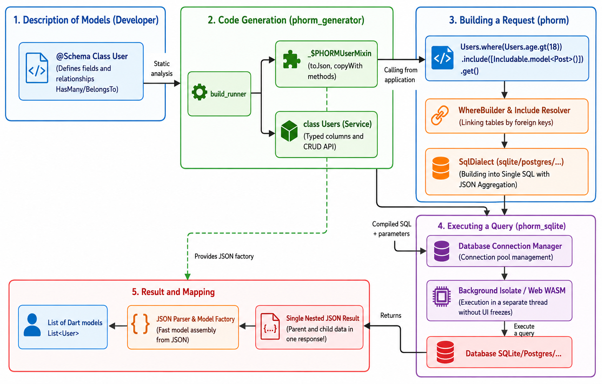

<div align="center">
  

  <br/>

[](https://pub.dev/packages/phorm)
[](https://pub.dev/packages/phorm_sqlite)
[](https://pub.dev/packages/phorm_generator)
[](https://pub.dev/packages/phorm_annotations)
[](https://marketplace.visualstudio.com/items?itemName=interlibdev.phorm-code)
[](https://open-vsx.org/extension/interlibdev/phorm-code)
[](https://github.com/interdev7/phorm/actions)
[](https://codecov.io/gh/interdev7/phorm)
[](https://opensource.org/licenses/MIT)
[](https://dart.dev)
[](https://flutter.dev)
[](https://pubstats.dev/packages/phorm_sqlite/popularity.svg)

</div>

[](https://ko-fi.com/T6T71WI3NN)

# PHORM (***P***redictable ***H***armonious **_ORM_**)

A lightweight, type-safe, driver-agnostic ORM for Dart and Flutter.

📚 **Documentation: [interdev7.github.io/phorm](https://interdev7.github.io/phorm/)**

**PHORM** is designed from the ground up to be database-independent. It separates query building and relationship mapping from database-specific SQL grammar using a pluggable **Dialect system**. This allows using the same declarative models and generated service APIs across multiple SQL backends, starting with SQLite (via `phorm_sqlite`) and expanding to PostgreSQL, MySQL and more in the future.

By leveraging **Single-Query JSON Aggregation**, PHORM aggregates complex parent-child relationship trees into a **single, highly-optimized SQL query** using database-native JSON capabilities (such as SQLite's `json_group_array` or PostgreSQL's `jsonb_agg`), offering stellar performance and zero N+1 query overhead.

## Architecture

<p align="center">
  
</p>

---

## Packages

| Package                                           | Install?              | Description                                                                            |
| :------------------------------------------------ | :-------------------- | :------------------------------------------------------------------------------------- |
| [phorm_sqlite](./packages/phorm_sqlite)           | ✅ `dependencies`     | SQLite driver — includes full phorm core, use this for all SQLite projects             |
| [phorm_generator](./packages/phorm_generator)     | ✅ `dev_dependencies` | Code generator — SQL schemas, `toJson`/`fromJson`, static service mixins               |
| [phorm](./packages/phorm)                         | ⚙️ driver authors     | Core engine only — CRUD, WhereBuilder, Transactions; already included via phorm_sqlite |
| [phorm_annotations](./packages/phorm_annotations) | ⚙️ driver authors     | Annotation library — `@Schema`, `@Column`, `@ID`; already included via phorm           |

---

## Tooling

| Tool                                                                                                                   | Description                                                                                                                                                                                                                                            |
| :--------------------------------------------------------------------------------------------------------------------- | :----------------------------------------------------------------------------------------------------------------------------------------------------------------------------------------------------------------------------------------------------- |
| [PHORM Code Generator](https://marketplace.visualstudio.com/items?itemName=interlibdev.phorm-code) (VS Code extension) | Convert a plain Dart class into a PHORM model in one click — adds `@Schema`/`@Column`/`@ID`, the `id` field, constructor and `fromJson`. Also ships snippets and a `build_runner` command. Source: [`extensions/phorm-code`](./extensions/phorm-code). |

Install it from the VS Code Marketplace (search **"PHORM Code Generator"**) or run:

```
code --install-extension interlibdev.phorm-code
```

---

## Motivation 🎯

PHORM was created to solve three main problems in Flutter database management:

1. **Type Safety over Strings**: Most SQLite wrappers rely on `Map<String, dynamic>`. PHORM generates type-safe columns and models, catching errors at compile-time rather than runtime.
2. **Active Record DX**: Instead of managing complex DAO/Repository layers, PHORM provides a clean, declarative API directly on your models (`Users.insert()`, `Users.where(...)`).
3. **Performance & Relationships**: Fetching complex graphs (Many-to-Many, HasMany) usually leads to N+1 query problems. PHORM uses JSON aggregation to resolve entire dependency trees in a **single SQL query**.

---

## Installation

For most projects, you only need **two packages**:

```yaml
dependencies:
  phorm_sqlite: ^1.0.0 # SQLite driver — automatically includes phorm core

dev_dependencies:
  phorm_generator: ^1.0.0 # Code generation (SQL schemas, toJson/fromJson)
  build_runner: ^2.4.0
```

> `phorm_sqlite` re-exports the entire `phorm` core, so a separate `phorm:` dependency is **not needed**.
>
> Add `phorm` directly only if you are building a **custom database driver** (e.g. `phorm_postgres`).

---

## Quick Start

```dart
// One import covers everything: PhormCore, WhereBuilder, DB, Table, etc.
import 'package:phorm_sqlite/phorm_sqlite.dart';

// 1. Table config (auto-generated by phorm_generator)
final usersTable = Table<User>(...);

// 2. DB manager
final appDb = DB.autoVersion(
  databaseName: 'app.db',
  tables: [usersTable],
);

// 3. Recommended: static service API on your model
await Users.insert(user);
final user = await Users.readOne('id123');

// 4. Fluent queries
final adults = await Users
    .where(Users.age.gt(18))
    .orderBy(Users.name)                        // ASC
    .orderBy(Users.createdAt, descending: true) // DESC
    .get();

// 5. Direct PhormCore access (for advanced use / transactions)
final svc = appDb.service<User>();
final paged = await svc.readAllWithCount(limit: 20);

// 6. Transactions
await appDb.transaction((txn) async {
  await svc.insert(newUser, executor: txn);
  await Posts.insertBatch(posts, executor: txn);
});
```

---

## Key Features

- **🚀 Performance** — Load complex relationships in **exactly one** SQL query via JSON aggregation
- **🛡️ Type Safety** — No `dynamic` maps in queries; compile-safe `Includable.model<T>()`
- **🔍 Fluent API** — `WhereBuilder` and `SortBuilder` with full SQL injection protection
- **🔗 Cross-table Filtering** — Filter by related table columns with automatic `LEFT JOIN`
- **🗑️ Soft Deletes** — Built-in paranoid mode with restore support
- **📦 Batch & Transactions** — Atomic bulk operations
- **🔄 Smart Migrations** — Versioned, idempotent migration tracking
- **🌐 Flutter Web** — WebAssembly (WASM) backend with IndexedDB persistence, zero code changes

---

## CRUD Methods

| Method                  | Returns                      | Description               |
| :---------------------- | :--------------------------- | :------------------------ |
| `insert(item)`          | `Future<int>`                | Row ID                    |
| `update(item)`          | `Future<int>`                | Affected rows             |
| `upsert(item)`          | `Future<void>`               | Insert or replace         |
| `readOne(id)`           | `Future<T?>`                 | By primary key            |
| `readAll(...)`          | `Future<Result<T>>`          | Paginated list            |
| `readAllWithCount(...)` | `Future<ResultWithCount<T>>` | List + total count        |
| `delete(id)`            | `Future<int>`                | Soft or hard delete       |
| `restore(id)`           | `Future<int>`                | Un-delete (paranoid only) |
| `exists(id)`            | `Future<bool>`               | Check presence            |
| `transaction(fn)`       | `Future<R>`                  | Raw transaction           |

---

## WhereBuilder Highlights

```dart
Users.where(Users.status.eq('active'))
  .where(Users.age.gt(18))
  .where(Users.name.like('%John%'))
  .get();

// Manual WhereBuilder still works
WhereBuilder().eq(Users.status, 'active').gt(Users.age, 18);
```

---

## Documentation

Full documentation is in the [`docs/`](./docs) folder:

| File                                                                  | Contents                                                          |
| :-------------------------------------------------------------------- | :---------------------------------------------------------------- |
| [01. Overview](./docs/01-overview.md)                                 | Architecture, why PHORM, package structure                        |
| [02. Schema Definition](./docs/02-schema-definition.md)               | `@Schema`, `@Column`, `@ID`, data types, indexes, CHECK           |
| [03. Where Builder](./docs/03-where-builder.md)                       | All WhereBuilder methods, groups, cross-table filtering, pitfalls |
| [04. CRUD Operations](./docs/04-crud-operations.md)                   | Insert, Read, Update, Delete, Batch, Transactions, Attributes     |
| [05. Relationships](./docs/05-relationships.md)                       | HasMany, HasOne, BelongsTo, Includable API, fromJson patterns     |
| [06. DB and Migrations](./docs/06-db-and-migrations.md)               | DB manager, MigrationBuilder, version lifecycle                   |
| [07. Code Generation](./docs/07-code-generation.md)                   | Generator setup, commands, generated code anatomy                 |
| [08. Soft Deletes](./docs/08-soft-deletes.md)                         | Paranoid mode, restore, hard delete                               |
| [09. Pitfalls and Limitations](./docs/09-pitfalls-and-limitations.md) | Known issues, gotchas, design trade-offs                          |
| [10. Validators](./docs/10-validators.md)                             | Built-in validators (NotEmpty, Email, Range, etc.)                |
| [11. Many to Many](./docs/11-many-to-many.md)                         | Detailed guide on pivot tables and Many-to-Many setup             |
| [12. Query Builder](./docs/12-query-builder.md)                       | Fluent API reference — .get(), .first(), chaining                 |
| [13. Seeders and Factories](./docs/13-seeders-and-factories.md)       | Data seeding and mock generation for testing                      |
| [14. Reactivity](./docs/14-reactivity.md)                             | Reactive streams, watchOne(), watchAll(), updatesSync integration |
| [15. Flutter Web](./docs/15-flutter-web.md)                           | **Flutter Web / WASM** — setup, IndexedDB persistence, limits     |

---

## Contributing

This monorepo is managed with [Melos](https://melos.invertase.dev). To get started:

```bash
dart pub global activate melos
melos bootstrap   # link local packages and fetch dependencies
melos run test    # run tests in every package
melos run analyze # static analysis in every package
melos run format  # verify formatting
```

Releasing: run `melos run release-check` — it verifies that every package's
pubspec version, CHANGELOG and pub.dev state are consistent, and prints the
publish commands for pending releases in dependency order. Git tags and
GitHub Releases are created automatically by CI (`auto_tag` in `main.yml`)
once the version bump lands on `main` — never tag manually.

---

## License

MIT © 2024–2026 PHORM Contributors
