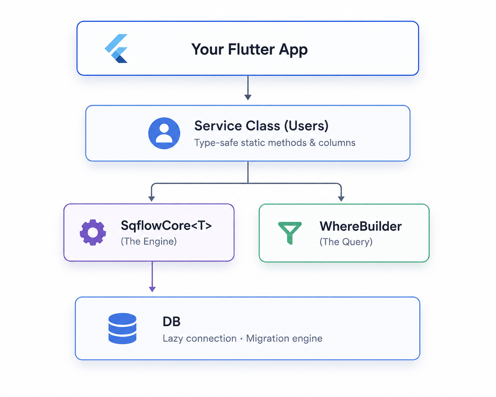

<div align="center">
  <!--  -->
  
</div>

# PHORM (***P***redictable ***H***armonious **_ORM_**)

A lightweight, type-safe, driver-agnostic ORM for Dart and Flutter.

SQFlow is designed from the ground up to be database-independent. It separates query building and relationship mapping from database-specific SQL grammar using a pluggable **Dialect system**. This allows using the same declarative models and generated service APIs across multiple SQL backends, starting with SQLite (via `sqflow_lite`) and expanding to PostgreSQL and MySQL in the future.

By leveraging **Single-Query JSON Aggregation**, SQFlow aggregates complex parent-child relationship trees into a **single, highly-optimized SQL query** using database-native JSON capabilities (such as SQLite's `json_group_array` or PostgreSQL's `jsonb_agg`), offering stellar performance and zero N+1 query overhead.

## Architecture

<p align="center">
  
</p>

---

## Packages

| Package                                                  | Description                                                         |
| :------------------------------------------------------- | :------------------------------------------------------------------ |
| [sqflow_core](./sqflow_core)                             | Runtime engine — CRUD, WhereBuilder, Transactions, Eager Loading    |
| [sqflow_lite](./sqflow_lite)                             | SQLite driver — Connection manager, isolates, web WASM support      |
| [sqflow_platform_interface](./sqflow_platform_interface) | Annotation library — `@Schema`, `@Column`, `@ID`, relationships     |
| [sqflow_generator](./sqflow_generator)                   | Code generator — automates SQL schemas, `toJson`/`fromJson`, mixins |

---

## Key Features

- **🚀 Performance** — Load complex relationships in **exactly one** SQL query via JSON aggregation
- **🛡️ Type Safety** — No `dynamic` maps in queries; compile-safe `Includable.model<T>()`
- **🔍 Fluent API** — `WhereBuilder` and `SortBuilder` with full SQL injection protection
- **🔗 Cross-table Filtering** — Filter by related table columns with automatic `LEFT JOIN`
- **🗑️ Soft Deletes** — Built-in paranoid mode with restore support
- **📦 Batch & Transactions** — Atomic bulk operations
- **🔄 Smart Migrations** — Versioned, idempotent migration tracking
- **🌐 Flutter Web** — WebAssembly (WASM) backend with IndexedDB persistence, zero code changes

---

## Quick Start

```dart
@Schema(
  tableName: 'users',
  paranoid: true,
  relationships: [HasMany(model: Post, foreignKey: 'user_id')],
)
class User extends Model with _$SQFlowUserMixin {
  @ID()
  final String id;

  @Column()
  final String name;

  User({required this.id, required this.name});

  factory User.fromJson(Map<String, dynamic> json) => _$SQFlowUserFromJson(json);
}
```

```dart
// 1. Fluent API (Recommended) 🌟
final myPosts = await Posts.where(Posts.title.like('Dart%')).get();

// 2. Complex queries with relationships
final result = await Users.query
  .where(Posts.title.like('Dart%'))
  .include([Includable.model<Post>()])
  .get();

// 3. Traditional SqflowCore instance (if needed)
final paged = await userService.readAllWithCount(
  where: WhereBuilder().like(Posts.title, 'Dart%'),
  limit: 20,
  offset: 0,
);
print('Showing ${paged.data.length} of ${paged.count}');
```

---

## Documentation

Full documentation is in the [`docs/`](./docs) folder:

| File                                                                  | Contents                                                          |
| :-------------------------------------------------------------------- | :---------------------------------------------------------------- |
| [01. Overview](./docs/01-overview.md)                                 | Architecture, why SQFlow, package structure                       |
| [02. Schema Definition](./docs/02-schema-definition.md)               | `@Schema`, `@Column`, `@ID`, data types, indexes, CHECK           |
| [03. Where Builder](./docs/03-where-builder.md)                       | All WhereBuilder methods, groups, cross-table filtering, pitfalls |
| [04. CRUD Operations](./docs/04-crud-operations.md)                   | Insert, Read, Update, Delete, Batch, Transactions, Attributes     |
| [05. Relationships](./docs/05-relationships.md)                       | HasMany, HasOne, BelongsTo, Includable API, fromJson patterns     |
| [06. DB and Migrations](./docs/06-db-and-migrations.md)               | DB manager, MigrationBuilder, version lifecycle                   |
| [07. Code Generation](./docs/07-code-generation.md)                   | Generator setup, commands, generated code anatomy                 |
| [08. Soft Deletes](./docs/08-soft-deletes.md)                         | Paranoid mode, restore, hard delete                               |
| [09. Pitfalls and Limitations](./docs/09-pitfalls-and-limitations.md) | Known issues, gotchas, design trade-offs                          |
| [10. Validators](./docs/10-validators.md)                             | Built-in validators (NotEmpty, Email, Range, etc.)                |
| [11. Many to Many](./docs/11-many-to-many.md)                         | Detailed guide on pivot tables and Many-to-Many setup             |
| [12. Query Builder](./docs/12-query-builder.md)                       | Fluent API reference — .get(), .first(), chaining                 |
| [13. Seeders and Factories](./docs/13-seeders-and-factories.md)       | Data seeding and mock generation for testing                      |
| [14. Reactivity](./docs/14-reactivity.md)                             | Reactive streams, watchOne(), watchAll(), updatesSync integration |
| [15. Flutter Web](./docs/15-flutter-web.md)                           | **Flutter Web / WASM** — setup, IndexedDB persistence, limits     |

---

## 📄 License

Apache 2.0
