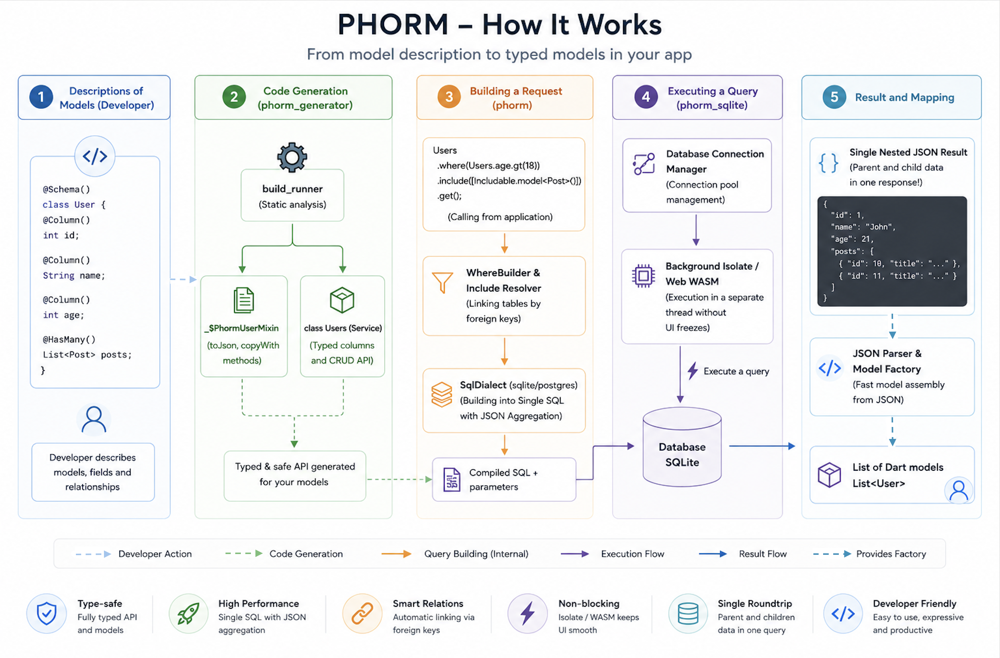

<p align="center">
  
</p>

# PHORM — Overview

PHORM (Single Query Flow) is a lightweight, type-safe, driver-agnostic ORM for Dart and Flutter. It is designed to separate model definitions and fluent query building from database-specific SQL grammar using a pluggable **Dialect system**. This allows you to write one unified set of models and type-safe query calls, and execute them seamlessly across SQLite (via `phorm_sqlite`), PostgreSQL, or MySQL, utilizing background isolates and asynchronous connection pooling without raw SQL concatenation.

## Motivation

Modern database management in Flutter often forces a trade-off between **performance** and **developer experience**. PHORM is designed to eliminate that trade-off by focusing on four core pillars:

### 1. Zero N+1 Queries (JSON Aggregation)

Traditional ORMs often fetch related data by running multiple queries (the N+1 problem) or using complex JOINs that duplicate parent data.

- **PHORM Solution**: It leverages the database's native JSON aggregation capabilities (such as SQLite's `json_group_array`/`json_object` or PostgreSQL's `jsonb_agg`/`jsonb_build_object`, compiled dynamically by the active `SqlDialect`) to fetch a primary record and all its related nested structures (HasMany, HasOne, BelongsTo) in **one single, highly-optimized SQL query**. The database compiles this tree natively and returns it in a single trip, avoiding any network or driver roundtrips.

### 2. Fluent Type Safety

Writing SQL queries as strings is error-prone and hard to maintain.

- **PHORM Solution**: The generator creates static typed columns for every model. Instead of `where: "name LIKE 'A%'"`, you write `Users.name.like('A%')`. This gives you autocomplete, compile-time checks, and prevents SQL injection by default.

### 3. Automatic Lifecycle Management

Most apps need the same patterns: "When was this created?", "Don't actually delete it, just mark it as deleted", "Validate this email before saving".

- **PHORM Solution**: By adding a few parameters to the `@Schema` annotation, PHORM automatically handles:
  - **Timestamps**: Injects `created_at` and `updated_at` without manual fields.
  - **Soft Deletes**: Automatically filters out "deleted" records and provides a `restore()` API.
  - **Validation**: Enforces rules (email, length, ranges) in both Dart and the SQL schema.

### 4. Boilerplate-Free Workflow

- **PHORM Solution**: The generator doesn't just create `toJson/fromJson`. It generates a full **Service Class** (e.g., `Users`) with static methods for CRUD, transactions, and reactive streams (`watch`). No more manual repository patterns or DAOs.

---

## Architecture

<p align="center">
  
</p>

---

## Dialects & Pluggable SQL Architecture

To ensure the library is future-proof and database-agnostic, PHORM separates query building and model mapping from the specific SQL grammar of target databases. It accomplishes this through the **`SqlDialect`** interface defined in `phorm`.

The query builder, JSON eager loading system, and column compiler in `phorm` never generate hardcoded database-specific SQL strings. Instead, they delegate to the active `SqlDialect` to resolve details like:

- **Identifier Escaping**: SQLite/Postgres uses `"table"."column"`, while MySQL uses `` `table`.`column` ``.
- **Positional Placeholders**: SQLite uses `?`, Postgres uses `$1`, `$2`, etc.
- **JSON Object Construction**: SQLite compiles to `json_object('key', val)`, while Postgres compiles to `jsonb_build_object('key', val)`.
- **JSON Array Aggregation**: SQLite compiles to `(SELECT json_group_array(...) FROM ...)`, while Postgres compiles to `coalesce((SELECT jsonb_agg(...) FROM ...), '[]'::jsonb)`.

This makes it exceptionally easy to swap the underlying database driver without changing a single line of your application models or query builders.

---

## Future Database Roadmap

PHORM's modularity paves the way for cross-platform, enterprise-ready database adapters:

| Driver Package       | Target Database     | Status                        | Dialect Implementation                                                                             | Under-the-Hood Driver     |
| :------------------- | :------------------ | :---------------------------- | :------------------------------------------------------------------------------------------------- | :------------------------ |
| **`phorm_sqlite`**   | **SQLite**          | **Stable (Production-ready)** | `SqliteDialect` (Single-query JSON aggregation, isolate ports, WebAssembly WASM, IndexedDB)        | `sqlite3` & `sqlite3_web` |
| **`phorm_postgres`** | **PostgreSQL**      | **Planned**                   | `PostgresDialect` (Positional `$1` parameters, schema namespaces, JSONB arrays, binary aggregates) | `postgres` (Dart)         |
| **`phorm_mysql`**    | **MySQL / MariaDB** | **Planned**                   | `MysqlDialect` (Backtick escapes, `json_object`, limit offsets)                                    | `mysql_client` / `mysql1` |

When a new driver is introduced, your declarative schemas `@Schema(...)` and code-generated services (like `Users`) remain **100% identical**. Only the database initialization (`DB` manager instantiation) changes!

> [!NOTE]
> **A Note on DDL Schemas:**
> While your Dart models and generated database services remain identical and fully database-agnostic at runtime, the DDL table schema automatically emitted by the `phorm_generator` currently targets SQLite-specific constructs (such as mapped types and SQLite trigger syntax for timestamps). For other databases, manual schema definitions or custom migration scripts should be used.

---

## Package Structure

| Package             | Role                                                                            |
| :------------------ | :------------------------------------------------------------------------------ |
| `phorm_annotations` | Annotations (`@Schema`, `@Column`, `@ID`), data types, relationship definitions |
| `phorm`             | Driver-agnostic runtime: `PhormCore<T>`, `WhereBuilder`, `SortBuilder`          |
| `phorm_sqlite`      | SQLite driver & connection manager: `DB`, isolates, WASM, custom SQL functions  |
| `phorm_generator`   | `build_runner` plugin that generates mixins, SQL, and serialization code        |

---

## Quick Install

```yaml
dependencies:
  phorm_sqlite: ^1.0.0 # SQLite driver — automatically includes phorm core

dev_dependencies:
  phorm_generator: ^1.0.0 # Code generation (SQL schemas, toJson/fromJson)
  build_runner: ^2.4.0
```

---

## Minimal Example

```dart
import 'package:phorm_sqlite/phorm_sqlite.dart';

// 1. Annotate your model
@Schema(tableName: 'users')
class User extends Model with _$PhormUserMixin {
  @ID()
  final String id;

  @Column()
  final String name;

  User({required this.id, required this.name});

  factory User.fromJson(Map<String, dynamic> json) => _$PhormUserFromJson(json);
}

// 2. Run the generator
// dart run build_runner build

// 3. Initialize app database once (from phorm_sqlite)
final appDb = DB(databaseName: 'app.db', version: 1, tables: [usersTable]);

// 4. Use the generated service class
await Users.insert(User(id: 'u1', name: 'Alice'));

final user = await Users.readOne('u1');

final list = await Users.where(Users.name.like('A%')).get();

final paged = await Users.readAllWithCount(limit: 20);
print('Page: ${paged.data.length} / Total: ${paged.count}');
```
