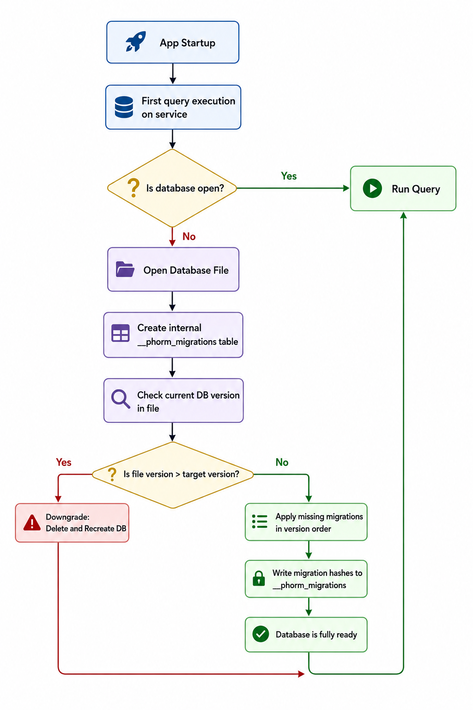

# DB Manager & Migrations

The `DB` class (provided by the **`phorm_sqlite`** package) manages the database connection lifecycle and schema migrations. It is built on top of `sqlite3` with an isolate-based architecture for non-blocking database operations, and adds a smart, idempotent migration tracking system using an internal `__phorm_migrations` table.

---

## Creating a DB Instance

To use the database manager, import `phorm_sqlite`:

```dart
import 'package:phorm_sqlite/phorm_sqlite.dart';
```

### Manual Version

```dart
final db = DB(
  databaseName: 'my_app.db',  // Stored at platform's default path
  version: 3,                  // Must be >= all migration versions
  tables: [usersTable, ordersTable],
);
```

> [!WARNING]
> If any table has a migration with `targetVersion > version`, `DB` throws `ArgumentError` at construction time. Always increment `version` when adding new migrations.

### Auto Version (Recommended)

Automatically determines the `version` as the maximum across all table migrations.

```dart
final db = DB.autoVersion(
  databaseName: 'my_app.db',
  tables: [usersTable, ordersTable],
);
// db.version == max(migration.targetVersion across all tables)
```

### In-Memory (for Testing)

```dart
final db = DB(
  databaseName: ':memory:',
  version: 1,
  tables: [usersTable],
);
```

---

## Lazy Initialization

The database connection is established **lazily** on first access. You don't need to call any `init()` method explicitly. The first operation on any `PhormCore` service triggers the database open.

```dart
// No manual init needed — triggers on first use
final user = await userService.readOne('id');
```

During initialization, the `DB` class:

1. Creates the `__phorm_migrations` tracking table.
2. Creates all registered tables from their `schema` strings.
3. Applies any pending migrations.

<p align="center">
  
</p>

---

## Migration System

PHORM uses a **versioned, idempotent migration system**. Each migration is tracked by a hash in the `__phorm_migrations` table and will never be applied twice.

### Defining Migrations

Migrations are defined using `MigrationBuilder` on a `Table` object.

```dart
final usersTable = Table<User>(
  name: 'users',
  schema: 'CREATE TABLE users (id TEXT PRIMARY KEY, name TEXT NOT NULL)',
  fromJson: User.fromJson,
).migrate()
  .addColumn(name: 'email', type: SqlTypes.text, version: 2)
  .addColumn(name: 'age', type: SqlTypes.integer, version: 2)
  .createIndex(name: 'idx_email', columns: ['email'], unique: true, version: 3)
  .build(); // Returns Table<User> with migrations attached
```

### Available Migration Operations

| Method              | SQL Generated                    | Parameters                                              |
| :------------------ | :------------------------------- | :------------------------------------------------------ |
| `.addColumn(...)`   | `ALTER TABLE ... ADD COLUMN ...` | `name`, `type`, `version`, `defaultValue?`, `nullable?` |
| `.createIndex(...)` | `CREATE INDEX IF NOT EXISTS ...` | `name`, `columns`, `version`, `unique?`                 |
| `.dropIndex(...)`   | `DROP INDEX IF EXISTS ...`       | `name`, `version`                                       |
| `.custom(...)`      | Custom SQL                       | `description`, `version`, `migrate` callback            |

> [!TIP]
> Use the **`SqlTypes`** class for type safety when adding columns in migrations (e.g., `SqlTypes.text`, `SqlTypes.integer`, `SqlTypes.real`). This prevents typos in SQL type names.

```dart
// Custom migration (arbitrary SQL)
.custom(
  description: 'Populate full_name from first+last',
  version: 4,
  migrate: (executor, table) async {
    await executor.execute(
      "UPDATE users SET full_name = first_name || ' ' || last_name",
    );
  },
)
```

### Version Lifecycle

```
DB version 1 → onCreate → creates all tables, applies migrations v<=1
DB version 2 → onUpgrade → applies migrations where v>oldVersion && v<=newVersion
DB version 2 → same version → no migrations applied (already tracked)
```

> [!IMPORTANT]
> Migrations are applied in **version order**, then by `priority` within the same version. Default priority is 0. Lower priority number = applied first.

---

## DB Utility Methods

```dart
// Get list of all applied migrations (useful for debugging)
final history = await db.getAppliedMigrations();
// Returns: [{table_name, migration_version, description, applied_at}, ...]

// Get actual version stored in the database file
final fileVersion = await db.getCurrentFileVersion();

// Manually sync migration history (edge case)
await db.synchronizeHistory();

// Close the connection
await db.close();

// Delete and recreate the database (⚠️ TESTING ONLY)
await db.reset();
```

---

## Resolving Services / Repositories

To simplify Developer Experience (DX) and avoid manually passing tables and database managers, you can resolve a `PhormCore<T>` service directly from the `DB` manager using the `db.service<T>()` method:

```dart
final db = DB.autoVersion(
  databaseName: 'app.db',
  tables: [usersTable, ordersTable],
);

// Resolves PhormCore<User> and PhormCore<Order> automatically
final userService = db.service<User>();
final orderService = db.service<Order>();
```

> [!NOTE]
> The generic type `T` must correspond to a model of a `Table` registered in this `DB` instance. If the model type is not registered, a `StateError` is thrown.

---

## Downgrade Behavior

> [!CAUTION]
> SQLite does not support native schema downgrades. When `DB.version` is **lower** than the version stored in the database file, PHORM **deletes and recreates the database from scratch**, losing all data.
>
> Never decrease `version` in production. Use this only for local development resets.

---

## Foreign Keys

PHORM enables `PRAGMA foreign_keys = ON` on every database open via `onConfigure`. This means:

- SQLite enforces referential integrity on your `FOREIGN KEY` constraints.
- Deleting a parent row that has related children will fail unless you've defined `ON DELETE CASCADE`.

> [!NOTE]
> The `@Schema` annotation and `phorm_generator` **automatically generate** `FOREIGN KEY` constraints in the `CREATE TABLE` SQL based on your `relationships` definition. There is no need to add them manually in the `schema` string.

---

## `__phorm_migrations` Table

PHORM creates this internal table automatically:

```sql
CREATE TABLE IF NOT EXISTS __phorm_migrations (
  id INTEGER PRIMARY KEY AUTOINCREMENT,
  table_name TEXT NOT NULL,
  migration_version INTEGER NOT NULL,
  migration_hash TEXT NOT NULL,
  description TEXT,
  applied_at TEXT NOT NULL,
  UNIQUE(table_name, migration_version, migration_hash)
)
```

A migration is identified by `(table_name, migration_version, migration_hash)`. If you modify a migration's SQL or description, the hash changes and the migration will be re-applied.

> [!WARNING]
> Do not manually modify the `__phorm_migrations` table. Corrupting it can cause migrations to be skipped or applied twice.

---

## Complete Example

```dart
import 'package:phorm_sqlite/phorm_sqlite.dart';

// Define tables
final usersTable = Table<User>(
  name: 'users',
  schema: '''
    CREATE TABLE users (
      id TEXT PRIMARY KEY,
      first_name TEXT NOT NULL,
      email TEXT UNIQUE,
      created_at TEXT NOT NULL,
      updated_at TEXT,
      deleted_at TEXT
    );
    CREATE INDEX idx_users_email ON users(email);
  ''',
  fromJson: _$PhormUserFromJson,
  // These values are typically generated automatically!
  // The primaryKey is detected from the @ID annotation.
  primaryKey: 'id',
  paranoid: true,
  timestamps: true,
  columns: ['id', 'first_name', 'email', 'created_at', 'updated_at', 'deleted_at'],
).migrate()
  .addColumn(name: 'age', type: SqlTypes.integer, version: 2)
  .createIndex(name: 'idx_users_created', columns: ['created_at'], version: 3)
  .build();

// Create DB with auto-version
final db = DB.autoVersion(
  databaseName: 'production.db',
  tables: [usersTable],
);

// Create service (Recommended)
final userService = db.service<User>();
```
