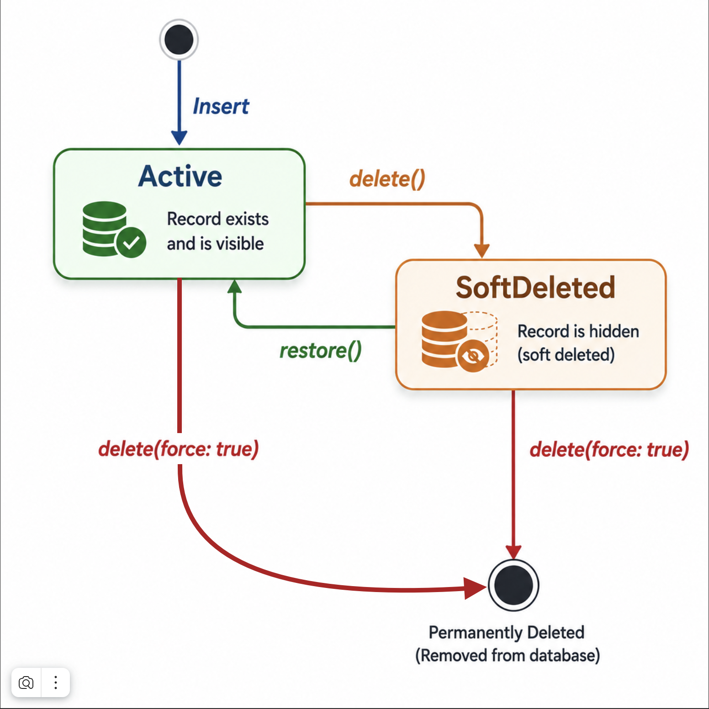

# Soft Deletes (Paranoid Mode)

Soft deletes allow you to "delete" records without physically removing them from the database. Instead, a `deleted_at` timestamp is set. This is useful for audit trails, undo functionality, and compliance requirements.

---

## Enabling Soft Deletes

```dart
@Schema(
  tableName: 'users',
  paranoid: true,   // ← Enable soft deletes
)
class User extends Model with _$PhormUserMixin { ... }
```

The generator adds the `deleted_at TEXT` column to the SQL schema and injects a `DateTime? deletedAt` field into your generated mixin automatically. You can access it on your model instance without any manual declaration.

---

## How It Works

<p align="center">
  
</p>

| Operation                    | `paranoid: false`              | `paranoid: true`                            |
| :--------------------------- | :----------------------------- | :------------------------------------------ |
| `delete(id)`                 | `DELETE FROM ... WHERE id = ?` | `UPDATE ... SET deleted_at = NOW()`         |
| `delete(id, force: true)`    | `DELETE FROM ...`              | `DELETE FROM ...` (bypasses soft delete)    |
| `readOne(id)`                | Returns record                 | Returns `null` if `deleted_at IS NOT NULL`  |
| `readAll()`                  | All records                    | Only records where `deleted_at IS NULL`     |
| `readAll(withDeleted: true)` | All records                    | All records including deleted               |
| `readAll(onlyDeleted: true)` | All records                    | Only records where `deleted_at IS NOT NULL` |

---

## Reading Soft-Deleted Records

```dart
// Only active records (default)
final result = await userService.readAll();

// Include deleted records
final result = await userService.readAll(withDeleted: true);

// Only deleted records (e.g., for a "Trash" screen)
final result = await userService.readAll(onlyDeleted: true);

// Read a specific record regardless of deletion status
final user = await userService.readOne('id', withDeleted: true);

// Check if ID exists including deleted
final exists = await userService.exists('id', withDeleted: true);
```

---

## Restoring Records

```dart
// Un-delete a record (clears deleted_at, updates updated_at)
await userService.restore('user_id');

// Bulk restore
await userService.restoreBatch(['id1', 'id2', 'id3']);
```

> [!WARNING]
> Calling `restore` on a table with `paranoid: false` throws `StateError: Soft delete not enabled`. Always check your table configuration.

---

## Hard Delete

Even with `paranoid: true`, you can permanently delete a record:

```dart
// Permanent delete, bypasses soft delete
await userService.delete('user_id', force: true);

// Bulk hard delete
await userService.deleteBatch(['id1', 'id2'], force: true);
```

---

## Custom `deleted_at` Field

If you want to customize the `deletedAt` field (e.g., to use a different column name or add specific annotations), you can declare it manually in your model class:

```dart
// Declare manually in your class for customization
@Column(columnName: 'removed_at')
final DateTime? deletedAt;
```

When declared manually, the generator will use your field instead of creating a default one in the mixin.

---

## Pitfalls

### 1. Filtering on `deleted_at` manually

If you add a manual condition on `deleted_at` in your `WhereBuilder`, PHORM will **not add the automatic `IS NULL` filter** (it detects if `deleted_at` already has a condition):

```dart
// This works correctly — PHORM skips auto-filter because you set it manually
final result = await userService.readAll(
  where: WhereBuilder().isNotNull('deleted_at'),
);
```

### 2. `upsert` with soft-deleted records

`upsert` uses `INSERT OR REPLACE`. If the ID already exists (even with `deleted_at` set), the entire row is **replaced** — including `deleted_at`, which will be set by `_withTimestamps` as `null`. This effectively restores a soft-deleted record silently.

### 3. Relationship queries and soft-deleted related records

When using `include` (eager loading), the JSON subquery does **not** automatically filter out soft-deleted related records. If you load `HasMany(orders)`, orders with `deleted_at IS NOT NULL` will be included.

To exclude soft-deleted related records, you would need a custom query approach.
