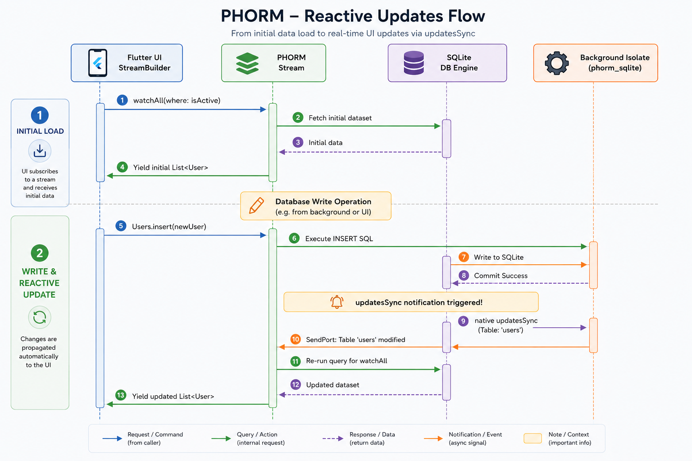

# PHORM — Reactive Streams & Real-time Watchers

PHORM features a robust, state-of-the-art reactive architecture that enables your UI to update in real time as the database changes. You can watch single records or entire datasets using simple stream-based APIs.

---

## How It Works Under the Hood

Unlike traditional ORMs that require manual hooks, observers, or trigger methods on every write, PHORM leverages native database-level notifications. The actual implementation details depend on the active **database dialect**:

1. **Dialect-Specific Notifications (`changeStream`)**:
   - **SQLite (`phorm_sqlite`)**: PHORM listens to the native `updatesSync` stream provided by the `sqlite3` driver. This stream receives notifications directly from the SQLite engine whenever _any_ table is modified (via `INSERT`, `UPDATE`, or `DELETE`), even if those modifications happen through raw SQL executions.
   - **PostgreSQL / Other Dialects**: Reactivity uses database-native pub-sub/notification systems (such as `LISTEN/NOTIFY` in PostgreSQL) or driver-level statement hooks to capture mutations.
2. **Isolate-Safe Dispatching**: For client-side drivers (like SQLite), these events are captured in the background database isolate and synchronously sent to the main isolate via `SendPort`.
3. **Transaction Buffering**: If writes occur within a transaction, notifications are buffered at the database level and are only emitted once the transaction **commits successfully**. If the transaction rolls back, all buffered notifications are discarded. This prevents redundant notifications and eliminates UI flickering during bulk operations.

<p align="center">
  
</p>

---

## Reactive APIs

`PhormCore<T>` provides two primary methods to watch data changes:

### 1. `watchOne(id)`

Watches a single record by its primary key. Emits the initial record immediately, and then re-emits the updated record whenever the table (or its dependencies) changes.

```dart
// Watch a user with ID '123'
final Stream<User?> userStream = Users.watchOne('123');

userStream.listen((user) {
  if (user != null) {
    print('User updated: ${user.firstName}');
  } else {
    print('User deleted');
  }
});
```

### 2. `watchAll()`

Watches a dataset. Emits the initial list immediately, and re-emits a fresh list of matching records whenever the target table (or its dependencies) changes.

```dart
// Watch all active users
final Stream<List<User>> activeUsersStream = Users.watchAll(
  where: Users.isActive.eq(true),
);

activeUsersStream.listen((users) {
  print('Total active users: ${users.length}');
});
```

---

## Dependency Tracking & Deep Watching

Often, models contain relationships (e.g., a `User` has many `Posts`). If you display a list of users with their posts, you want the UI to update not only when a user changes, but also when a post belonging to a user is inserted, updated, or deleted.

PHORM solves this beautifully through **Dependency Tracking**:

### Automatic Include-based Dependencies

When using `include` to load relations, PHORM **automatically detects** all related tables and registers them as dependencies for the stream.

```dart
// PHORM automatically registers 'posts' as a dependency because of the include block.
// If any post is inserted, updated, or deleted, this stream will automatically re-emit!
final Stream<User?> userWithPosts = Users.watchOne(
  'u1',
  include: [Includable.table('posts')],
);
```

### Explicit Dependencies

If you aren't using `include` but still want the watcher to re-emit when another table changes, you can declare explicit `dependencies`:

```dart
// Manually specify that this watcher should trigger on 'posts' changes
final Stream<User?> userStream = Users.watchOne(
  'u1',
  dependencies: ['posts'],
);
```

---

## Transaction Buffering Example

When you execute multiple operations in a transaction, the UI shouldn't undergo multiple rapid redraws (flashing/flickering). PHORM buffers all updates and notifies your streams only after the transaction is fully committed:

```dart
await db.transaction((txn) async {
  // These inserts will NOT trigger active watchers immediately
  await userService.insert(User(id: 'u2', firstName: 'Alice'), executor: txn);
  await userService.insert(User(id: 'u3', firstName: 'Bob'), executor: txn);
  await userService.insert(User(id: 'u4', firstName: 'Charlie'), executor: txn);

  // All watchers of the 'users' table will receive exactly ONE notification
  // at this point, when the transaction is committed!
});
```

---

## Key Advantages

- **100% Automatic**: You don't need to call manual notification or invalidation methods.
- **Raw SQL Support**: Because reactivity works at the database level (e.g., via SQLite's `updatesSync` or PostgreSQL's `LISTEN/NOTIFY`), even if you run raw SQL queries directly (e.g., `db.execute('UPDATE users SET status = "active"')`), all reactive streams watching the `users` table will automatically trigger and reload!
- **Isolate & Thread Friendly**: Database notifications are passed efficiently between isolates or threads without blocking the Flutter UI thread.
