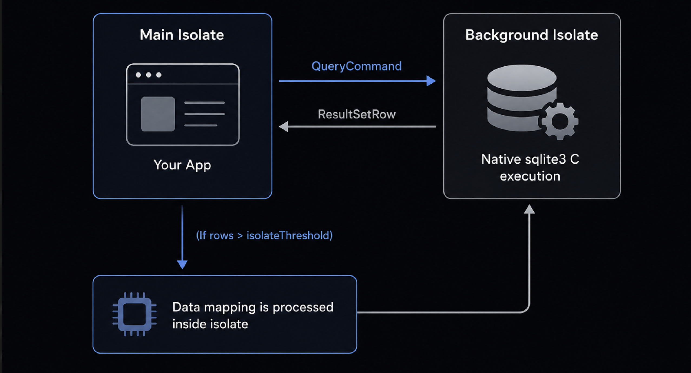

# PHORM SQLite 🚀

[](https://dart.dev/)
[](https://opensource.org/licenses/MIT)

`phorm_sqlite` is the official SQLite driver and connection manager implementation for the **PHORM ORM**.

It implements the database interfaces from `phorm` (`PhormDatabase`, `DatabaseExecutor`) and handles connection lifecycles, background isolate execution, custom SQL functions, and smart schema migrations.

---

## 📦 Role in PHORM Ecosystem

The PHORM ORM is split into modular packages:

1. **`phorm_annotations`** — Database-agnostic annotations (`@Schema`, `@Column`, `@ID`) and logical type definitions.
2. **`phorm`** — Driver-agnostic runtime engine containing CRUD APIs, `WhereBuilder` query builder, soft deletes, and eager loading via JSON Aggregation.
3. **`phorm_generator`** — Code generator (`build_runner`) that automates mixin, JSON, and runtime table configuration.
4. **`phorm_sqlite`** (This Package) — **The SQLite driver**. Implements connection pooling, background isolates (Native), WebAssembly persistence (Web), and smart migrations.

<p align="center">
  
</p>

---

## ⚡ Key Features

- **🧵 Non-Blocking Native Architecture** — Runs `sqlite3` operations in a dedicated background Dart `Isolate`. The Main/UI thread never stalls, even during heavy operations or massive query maps.
- **🌐 Seamless Web Support** — Out-of-the-box support for Flutter Web via WebAssembly (`sqlite3_web`) and **IndexedDB** virtual filesystem persistence. Zero platform checks needed in your application.
- **🛡️ Smart Migrations** — Idempotent, hash-tracked schema migration tracking via the internal `__phorm_migrations` table.
- **🔌 Custom SQL Functions** — Easy registration of Dart functions inside SQLite (e.g. native `REGEXP` support).
- **🔒 SQLCipher Support** — Option to provide a `password` parameter to encrypt native database files with SQLCipher.
- **📊 Slow Query Profiling** — Custom logger hooks to trace and alert when queries exceed a specified duration.

---

## ⚙️ Installation

Add `phorm_sqlite` to your `pubspec.yaml`:

```yaml
dependencies:
  phorm_sqlite: ^latest
  # phorm and phorm_annotations are pulled in automatically
```

---

## 🚀 Quick Start

### 1. Initialize the DB Manager

Create an instance of `DB` or `DB.autoVersion` to manage your SQLite connection:

```dart
import 'package:phorm_sqlite/phorm_sqlite.dart';

// Declare your tables (normally generated in .sql.g.dart)
final usersTable = Table<User>(...);

// Create the DB instance
final appDb = DB.autoVersion(
  databaseName: 'my_app.db', // Will be placed in default OS app support directory
  tables: [usersTable],
  logQueries: true, // Print SQL queries to console
  slowQueryThreshold: Duration(milliseconds: 150),
);
```

### 2. Configure Service Access

Resolve services directly from your database manager:

```dart
// Resolves the PhormCore<User> CRUD service
final userService = appDb.service<User>();

// CRUD operations
await userService.insert(User(id: 'u1', name: 'Alice'));
final user = await userService.readOne('u1');
```

---

## 🛠️ DB Configuration API

The `DB` constructor offers several tuning parameters:

| Parameter            | Type                | Default                | Description                                                                   |
| :------------------- | :------------------ | :--------------------- | :---------------------------------------------------------------------------- |
| `databaseName`       | `String`            | `'app_database.db'`    | The name of the file or `':memory:'` for in-memory databases.                 |
| `version`            | `int`               | _(Required)_           | The targeted database schema version.                                         |
| `tables`             | `List<Table>`       | _(Required)_           | The list of all registered `Table` schemas and migrations.                    |
| `customFunctions`    | `List<SqlFunction>` | `[]`                   | List of custom Dart-implemented functions to register in SQLite.              |
| `password`           | `String?`           | `null`                 | Password string for SQLCipher database encryption (Native only).              |
| `logger`             | `PhormLogger?`      | `PhormConsoleLogger()` | Custom logger implementation for tracing db events.                           |
| `logQueries`         | `bool`              | `false`                | Enables print logging of executed SQL queries and arguments.                  |
| `slowQueryThreshold` | `Duration`          | `200ms`                | Threshold duration after which a query is flagged as "slow" in logs.          |
| `singleInstance`     | `bool`              | `true`                 | Caches and reuses connection instances for the same path.                     |
| `isolateThreshold`   | `int`               | `50`                   | Row count threshold at which mapping is processed inside background isolates. |

### `DB.autoVersion`

A recommended factory constructor that automatically calculates the database schema `version` as the maximum `targetVersion` across all registered table migrations.

```dart
final db = DB.autoVersion(
  databaseName: 'app.db',
  tables: [usersTable, ordersTable],
);
```

---

## 🧵 Isolate-Based Architecture

In standard Flutter database setups, queries and subsequent data mapping (`fromJson`) run on the Main/UI thread. Under high load, this causes UI "jank" (dropped frames).

`phorm_sqlite` resolves this by using an **Isolate-based proxy router**:

<p align="center">
  
</p>

1. **Native Platforms**: Spawns a background `Isolate` that owns the synchronous `sqlite3` connection. Commands are sent across ports, executing database writes/reads safely off the UI thread.
2. **Flutter Web**: Relies on WebAssembly (`WasmSqlite3`) on the main thread. Since Dart isolates are simulated on Web, it utilizes direct async bindings to **IndexedDB** via `IndexedDbFileSystem` to persist files across reloads under the `phorm_` prefix.

---

## 🔌 Custom SQL Functions

SQLite allows executing custom logic inside SQL queries by registering Dart functions.

```dart
import 'package:phorm_sqlite/phorm_sqlite.dart';

// Create a custom reverse function
final reverseFn = SqlFunction(
  name: 'REVERSE_TEXT',
  argumentCount: 1,
  function: (args) {
    if (args[0] == null) return null;
    return args[0].toString().split('').reversed.join();
  },
);

// Instantiate DB with functions registered
final db = DB(
  version: 1,
  tables: [usersTable],
  customFunctions: [
    reverseFn,
    SqlFunction.regexp(), // Register native-like REGEXP support
  ],
);
```

You can now call these functions directly inside your SQL or queries:

```sql
SELECT REVERSE_TEXT(name) FROM users WHERE email REGEXP '.*@gmail\.com'
```

---

## 🔒 SQLCipher Encryption

To secure your application's offline data on native devices, pass a `password` parameter:

```dart
final db = DB.autoVersion(
  databaseName: 'secured.db',
  password: 'my-super-secret-passphrase',
  tables: [usersTable],
);
```

_Note: SQLCipher encryption is only available on Native IO platforms (iOS, Android, Desktop). It is silently ignored on Flutter Web due to browser-level WASM limitations._

---

## 📄 License

MIT License
